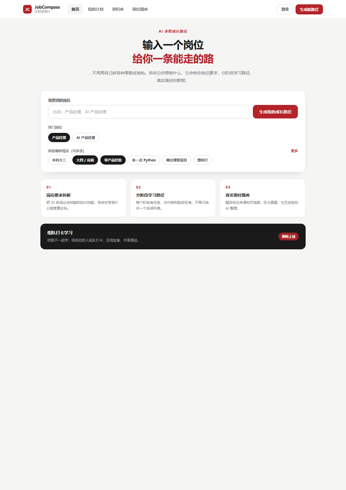
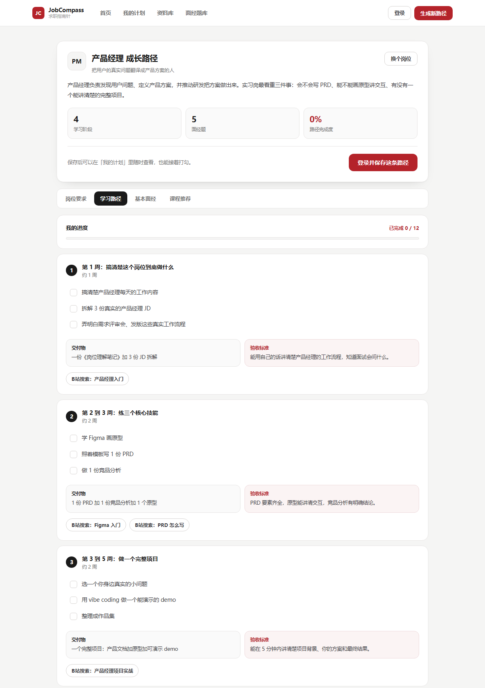
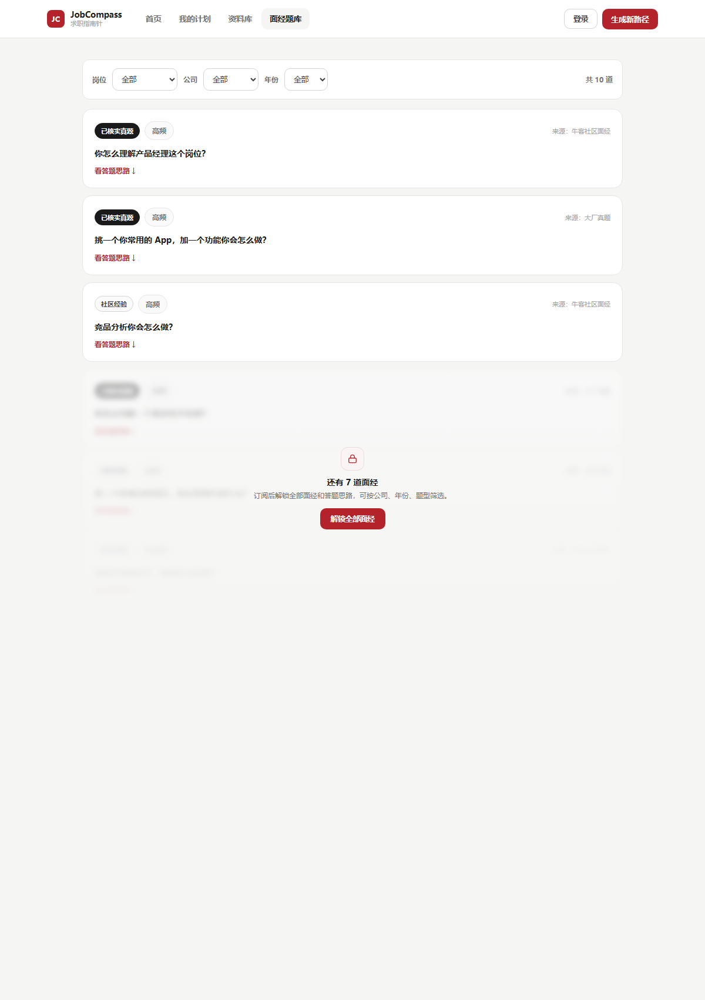
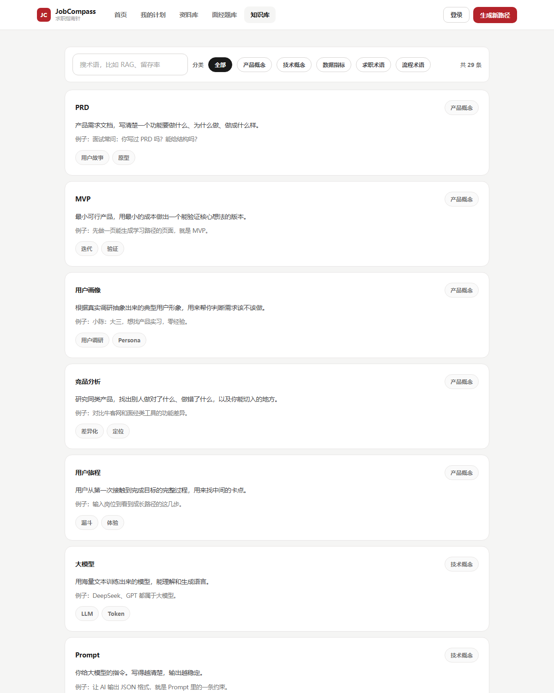

# JobCompass 求职指南针

面向在校求职者的 AI 成长路径工具。输入目标岗位，输出岗位要求拆解、分阶段学习路径、真实面经和课程推荐。



---

## 一、为什么做这个

准备求职的在校生，最大的困难不是缺少资料，而是资料太散、没有标准、无法判断真假。

岗位要求散在招聘网站，经验帖散在小红书，课程散在 B 站，面试题散在牛客。用户把这四类信息拼起来之后，仍然不知道该先学什么，也不知道学到什么程度算入门。

大模型和检索增强技术已经可以把这些非结构化内容整理成按岗位组织的结构化知识，但市面上的产品集中在简历优化、模拟面试和题库三个环节，从入门准备阶段切入的产品很少。

### 用户调研结论

访谈了 5 位目标用户，覆盖产品、数据分析、运营和电子信息方向。出现频率最高的三个问题是：

| 问题 | 出现次数 | 原话举例 |
| --- | --- | --- |
| 信息太散，筛选成本高 | 5／5 | "搜了一堆，看了一堆，啥都不记得" |
| 缺少达标标准 | 3／5 | "很难判断自己学到什么程度才算真正入门" |
| 不信任现有内容 | 4／5 | "对付费课程抱有怀疑，怕学完还是找不到方向" |

其中一位电子信息专业的同学提到，PCB 和硬件方向很依赖经验积累，企业很少愿意招实习生从头培养，所以更需要一个能自我判断进度的工具。这条反馈推动产品把"达标标准"设为所有岗位内容的强制字段。

---

## 二、目标用户

| 画像 | 情况 | 核心诉求 |
| --- | --- | --- |
| 目标明确型 | 大四，目标产品经理，零经验 | 想要一套能落地的行动方案 |
| 技能对标型 | 大四，目标数据分析或运营 | 想知道哪些技能必须会，学到什么程度够用 |
| 求稳型 | 大四，倾向熟悉或上手难度小的岗位 | 想在投入前确认岗位适不适合自己 |
| 工科探索型 | 电子信息专业 | 想判断入门标准，希望内容贴近真实就业 |

第一版重点服务前两类，后续版本扩展到工科方向。

---

## 三、产品功能

产品由五个页面组成，核心是生成后的成长路径页。

**首页**：输入目标岗位，勾选自身情况，一键生成。

**成长路径页**：生成后的结果页，包含四块内容。

- 岗位要求：技能分必会和加分，并给出三条达标标准
- 学习路径：分阶段展示任务、交付物、验收标准和对应学习资源，任务可打勾
- 基本面经：先展示一条，其余锁定
- 课程推荐：每门课说明学习理由与难度

**面经题库**：独立页面，支持按岗位、公司、年份筛选。

**知识库**：产品与技术术语解释，支持分类筛选和关键词搜索。

**资料库**：按技能分类的课程与教程。

**我的计划**：保存生成过的成长路径，可以随时回来继续。

---

## 四、界面演示

### 首页

输入岗位并勾选背景，点击生成。


### 成长路径页

四个模块通过页内标签切换。学习路径里每个阶段都有交付物和验收标准，任务可以打勾，进度条实时更新。



### 面经题库

按岗位、公司、年份筛选，每条标注来源与可信度。非会员可查看前三条，其余锁定。



### 知识库

术语按分类组织，支持搜索。每条包含解释、示例和相关术语。



---

## 五、权限设计

| 功能 | 访客 | 登录用户 | 会员 |
| --- | --- | --- | --- |
| 输入岗位并生成 | 可用 | 可用 | 可用 |
| 岗位要求与学习路径 | 可用 | 可用 | 可用 |
| 课程推荐 | 可用 | 可用 | 可用 |
| 知识库 | 可用 | 可用 | 可用 |
| 面经 | 路径页 1 条，题库页 3 条 | 更多基础面经 | 全部 |
| 保存路径与我的计划 | 触发登录 | 可用 | 可用 |
| 标准答题思路与来源链接 | 不可用 | 部分 | 可用 |

注册钩子只保留一个：保存成长路径。理由是这个动作发生在用户已经认可内容之后，转化意愿最高。

---

## 六、技术方案

| 层级 | 实现 | 说明 |
| --- | --- | --- |
| 前端 | HTML、CSS、原生 JavaScript | 单文件，无构建步骤 |
| 后端 | FastAPI | 提供接口并托管前端 |
| 数据库 | SQLite | 文件型数据库，零配置 |
| AI | DeepSeek | 结构化 JSON 输出 |

### 数据流程

```
采集 → 清洗 → 校验 → 入库 → 检索 → 生成 → 输出
```

当前已实现入库、生成和输出三个环节。采集与清洗由人工完成，检索属于下一版范围。

### AI 生成的降级策略

模型调用不可靠，所以做了三层保护：

未配置密钥时，直接使用内置数据；模型返回非法结构时，后端按默认值补齐字段；网络不可达或超时时，回退到内置数据。三种情况页面上都不会出现报错或白屏。

成本控制依赖同名岗位缓存。同一个岗位名第二次请求时直接读取数据库，不再调用模型。

---

## 七、目录结构

```
README.md
docs/                              产品文档
  01-产品定义与MVP范围.md
  02-竞品分析报告.md
  03-用户调研与画像.md
  04-产品需求文档.md
demo/
  jobcompass-prototype.html        可交互原型，双击即可打开
  screenshots/                     界面截图
backend/                           后端服务与数据库
  main.py                          接口与页面托管
  ai.py                            DeepSeek 调用与降级
  database.py                      数据库连接与迁移
  schema.sql                       表结构
  seed_data.py                     初始内容
  run.py                           启动入口
```

---

## 八、本地运行

需要 Python 3.10 或以上。

```bash
pip install -r backend/requirements.txt
python backend/run.py
```

打开 http://127.0.0.1:8000

不启动后端也可以直接看界面：双击 `demo/jobcompass-prototype.html`，页面会使用内置数据。

### 配置 AI

在 `backend/` 下创建 `.env` 文件：

```
DEEPSEEK_API_KEY=sk-xxxx
```

未配置时后端自动回退到内置数据，功能不受影响。密钥不会进入版本库。

---

## 九、接口

| 方法 | 路径 | 说明 |
| --- | --- | --- |
| GET | /api/bootstrap | 一次性返回前端所需全部数据 |
| GET | /api/roles | 岗位列表 |
| GET | /api/roles/{id} | 岗位详情 |
| GET | /api/interviews | 面经列表，支持岗位、公司、年份、关键词筛选 |
| GET | /api/interviews/filters | 面经筛选项 |
| GET | /api/courses | 课程列表，支持分类与关键词筛选 |
| GET | /api/courses/categories | 课程分类 |
| GET | /api/terms | 术语列表，支持分类与关键词筛选 |
| GET | /api/terms/categories | 术语分类 |
| GET | /api/plans | 已保存的学习计划 |
| POST | /api/plans | 保存或更新计划 |
| DELETE | /api/plans/{id} | 删除计划 |
| GET | /api/ai/status | AI 配置状态 |
| POST | /api/generate | 按岗位生成成长路径 |

`POST /api/generate` 的返回带一个 source 字段，用于区分内容来源：

| 取值 | 含义 |
| --- | --- |
| ai | 本次调用模型生成 |
| cache | 命中已有结果，未调用模型 |
| seed | 使用内置数据 |

---

## 十、数据库

SQLite，文件位于 `backend/data/jobcompass.db`，首次启动自动建表并写入初始数据。

| 表 | 说明 |
| --- | --- |
| roles | 岗位 |
| skills | 技能，区分必会与加分 |
| standards | 达标标准 |
| stages | 学习阶段 |
| stage_tasks | 阶段任务 |
| stage_resources | 阶段资源 |
| interviews | 面经，含公司、年份、来源、可信度 |
| courses | 课程，含分类、难度、学习理由 |
| terms | 术语，含分类、解释、示例 |
| saved_plans | 用户保存的学习计划 |

重置数据：

```bash
python backend/reset_db.py
```

---

## 十一、已知局限

这一节记录当前版本的不足，便于后续迭代。

内容来源以人工整理和 AI 生成为主，没有经过从业者逐条校验，可信度标注也还没有接入真实来源链接。

检索增强尚未实现。数据流程图里的检索环节属于下一步工作，当前生成结果完全依赖模型自身知识。

没有真实用户数据。埋点未接入，暂无留存、转化等指标。

账号体系与支付是前端状态模拟，刷新后重置。

内容量较小，目前覆盖两个岗位、十一条面经、二十九条术语。第三版会通过数据采集管道扩充。

---

## 十二、下一步

近期计划做三件事：接入检索增强，让生成结果引用术语库与面经库并标注来源；打通数据采集管道，把内容量提升一个量级；接入埋点，拿到真实的生成成功率与保存转化率。
